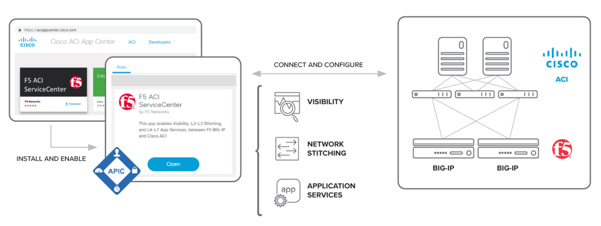

F5 ACI ServiceCenter dCloud Lab Guide
=====================================

This lab guide will cover the Cisco ACI and F5 BIG-IP integration using the Cisco AppCenter platform.

The integrated solution named F5 ACI ServiceCenter focusses on the following use cases:

===================== ============================================================================================================================================================
Feature               Capability                                                         
===================== ============================================================================================================================================================
Visibility            View BIG-IP network elements like VLANs, VIPs, and nodes, and correlate them with APIC information like Tenant | App | EPG.

L2-L3 Stitching       Facilitates L2-L3 stitching between APIC logical devices and BIG-IP (CRUD operations for VLAN, self IP, and default gateway).                                                

L4-L7 App Services    Create custom application definitions, with the ability to **Dry-run** and **Submit** the declaration.        
                                                                                       
                      It has two sub-tasks:                                             
                                                                                      
                      1) BIG-IP: Enables creation of BIG-IP AS3 declaration by:          
                                                                   
                         a) Writing the declaration JSON in provided text box or            
                                                                                         
                         b) Uploading AS3 declaration file                                  
                                                                                         
                                                                                         
                      2) Application: Enables AS3 application management with features   
                                                                                         
                         a) Create/delete a partition on BIG-IP                             
                                                                                         
                         b) Create/update/delete application on BIG-IP                      
===================== ============================================================================================================================================================

Overview

|
	

|
	
For more details on the integration refer to https://www.f5.com/cisco

|

|
	
.. toctree::
   :caption: F5 ACI Service Center dCloud lab guide
   :glob:
   :maxdepth: 2
   :hidden:

   intro.rst
   container_app.rst
   apic_configuration.rst
   app_configuration.rst
   manage_l2l3.rst
   api_postman_app.rst
   ansible_app.rst
   one_arm.rst