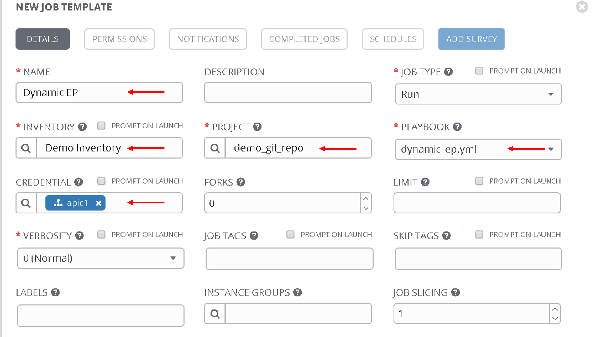
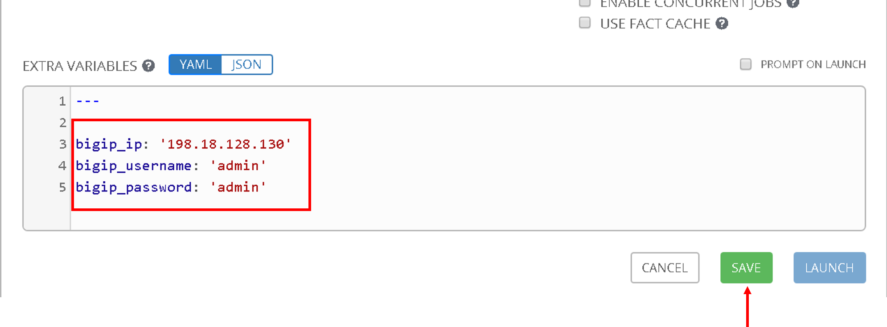
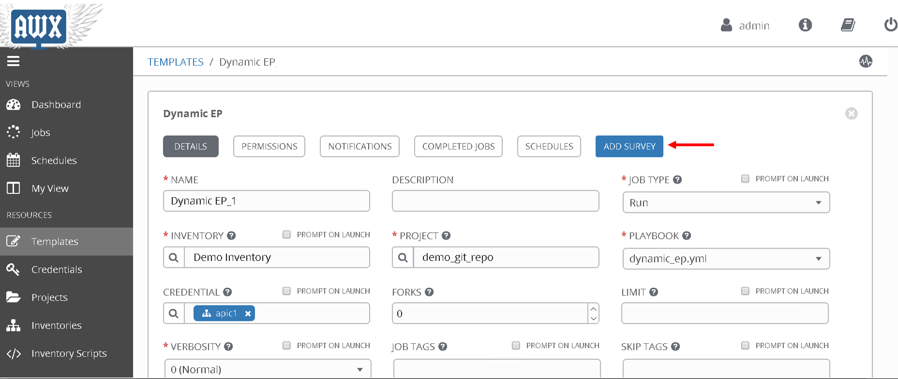
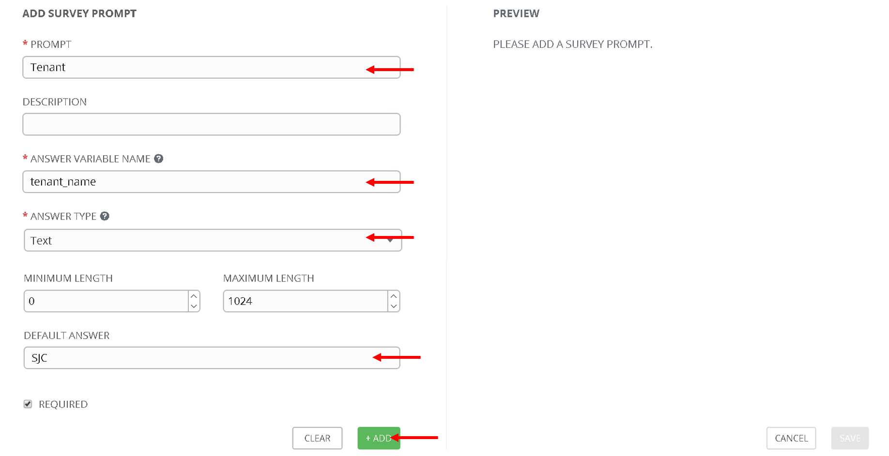
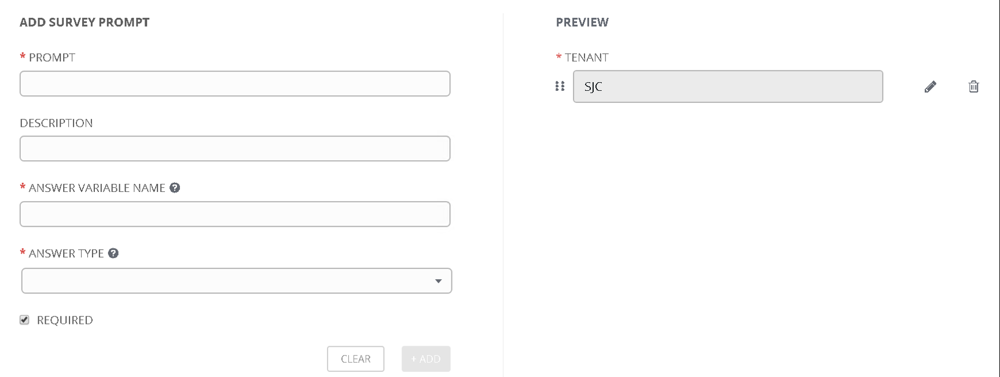
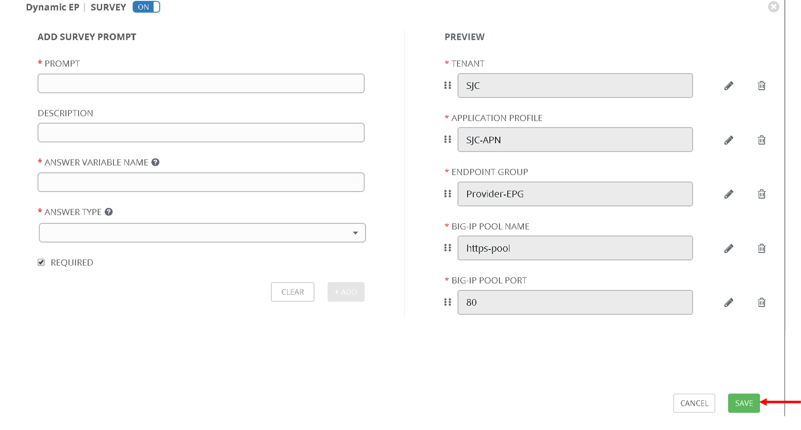

Dynamic End point attach/detach
===============================

This feature offloads the burden from a network administrator in terms of how to manage elastic workload. 

In this digital age the need to increase/decrease application workload has become more frequent to be able to handle the increase/decrease in traffic to the application.

Let's take a real world example of a service provider who wants to run a website. At moment t0, the website is unpopular and a single machine (most commonly a virtual machine) is sufficient to serve all web users. 
At moment t1, the website suddenly becomes popular and a single machine is no longer sufficient to serve all users. 
Based on the number of web users simultaneously accessing the website and the resource requirements of 
the web server, it might be that ten machines are needed. At this point nine additional machines vitual machines are bought online to serve all web users responsively.
These nine more web servers also need to added to the BIG-IP pool so that the traffic can be load balanced

At time t1, the website becomes unpopular again. The ten machines that are currently allocated to the website are mostly idle and a single machine would be sufficient to serve the few users who are accessing the website. 
The nine machines deprovisioner and used for some other purpose.

Now in the ACI world when application workload is added it is learned by the ACI fabric and becomes a part of an Endpoint Group on the ACI fabric

In the BIG-IP world that workload is the members of the load balanced pool.

So to summarize:

- Endpoint group on APIC = Pool on the BIG-IP

- Endpoints in an endpoint group = Pool members on the BIG-IP ( application servers handling traffic)

So when workload is commissioned/decommisioned it needs to also be added/deleted to a pool member on the BIG-IP.

Using ansible lets automate the process.

In our environment there are two EPGs

- Consumer-EPG (representing client)

- Provider-EPG (respresenting server/workload/node members)

Let's first look at the APIC and specifically the Provider-EPG and check what endpoints are currently learned

We see one endpoint has been learned with IP 10.193.102.2

Let's go to ansible tower and create a job template with the following parameters

- Name - 'Dynamic EP'
- Inventory - 'Demo Inventory'
- Project - 'demo_git_repo'
- Playbook - 'dynamic_ep.yml'
- Credential - 'apic1' (From the Credential type select 'Network' and then select 'apic1')

|

|

Scroll to the bottom and under the extra variables section add the following.

.. code-block:: yaml

  bigip_ip: '198.18.128.130'
  bigip_username: 'admin'
  bigip_password: 'admin'

Scroll to the bottom and click save

|

|

Now let's also create a **Survey** for this job template. Surveys set extra variables for the playbook similar to 'Extra Variables' as we did aboove but in a user-friendly question and answer way. Surveys also allows for validation of user input

Click on 'Add Survey' button on the top right corner of the job template. Start filling the following

|

|

- PROMPT: 'Tenant'
- ANSWER VARIABLE NAME: 'tenant_name'
- ANSWER TYPE: 'Text'
- DEFAULT ANSWER: 'SJC' (Let's provide a default value so that we dont have to enter it everytime we run the playbook)

|

|

Click +Add button , you will see Tenant variable added to the right hand pane now.

|

|

Continue this process for each extra variable that needs to be passed to the playbook

- PROMPT: 'Application Profile'
- ANSWER VARIABLE NAME: 'app_profile_name'
- ANSWER TYPE: 'Text'
- DEFAULT ANSWER: 'SJC-APN'

Click +Add button

- PROMPT: 'EndPoint Group'
- ANSWER VARIABLE NAME: 'epg_name'
- ANSWER TYPE: 'Text'
- DEFAULT ANSWER: 'Provider-EPG'

Click +Add button

- PROMPT: 'BIG-IP Pool Name'
- ANSWER VARIABLE NAME: 'pool_name'
- ANSWER TYPE: 'Text'
- DEFAULT ANSWER: 'https-pool'

Click +Add button

- PROMPT: 'BIG-IP Pool Port'
- ANSWER VARIABLE NAME: 'port_name'
- ANSWER TYPE: 'Integer'
- DEFAULT ANSWER: '80'

Click +Add button

Now you should see all the variables in the right hand pane. Scroll to the bottom and click 'Save'

|

|

!!Execute

!!Verify

!!Add more end points

!!Delete a few endpoints

!!How you can create a schedule to do the same