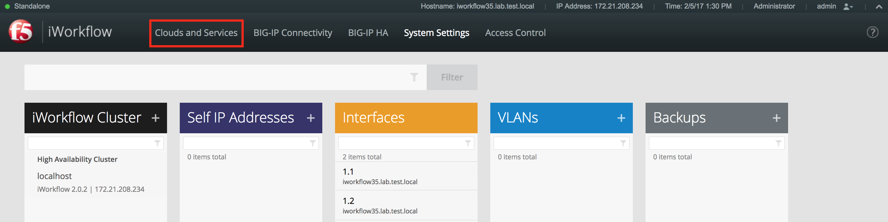
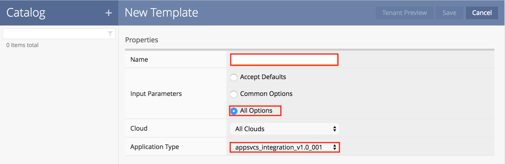
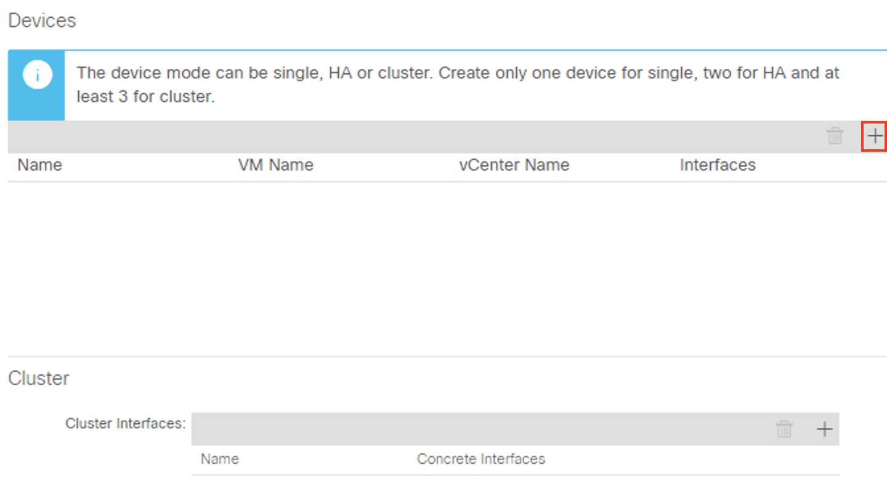
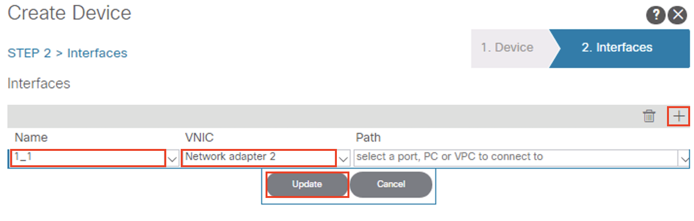
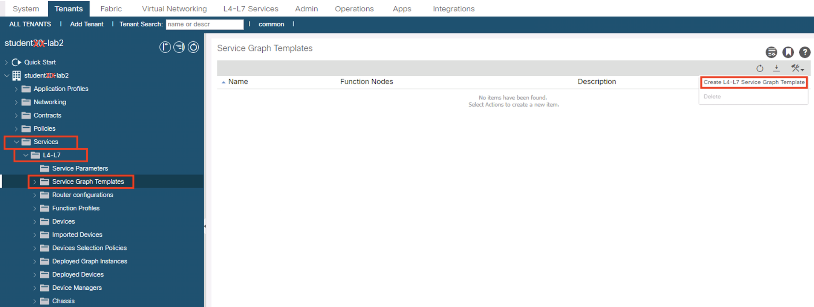
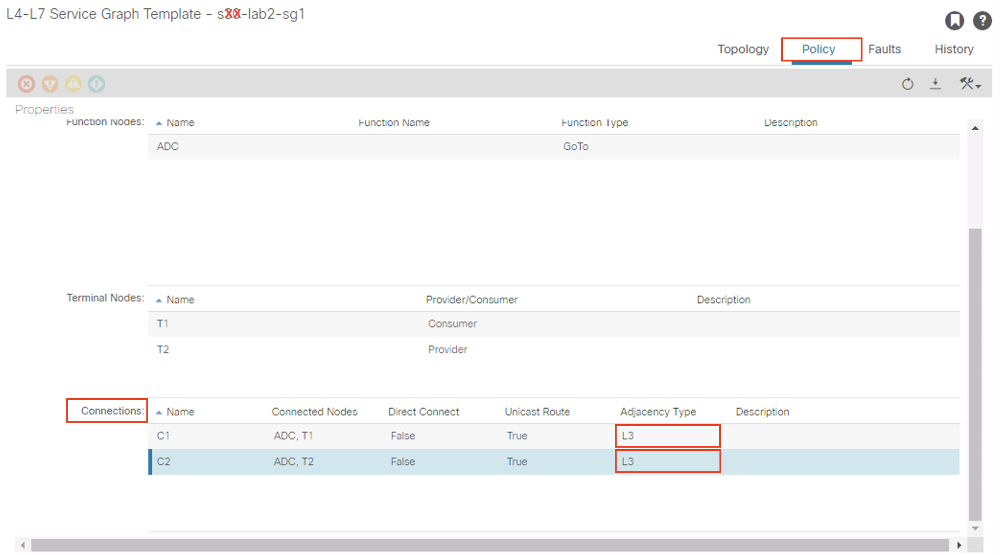
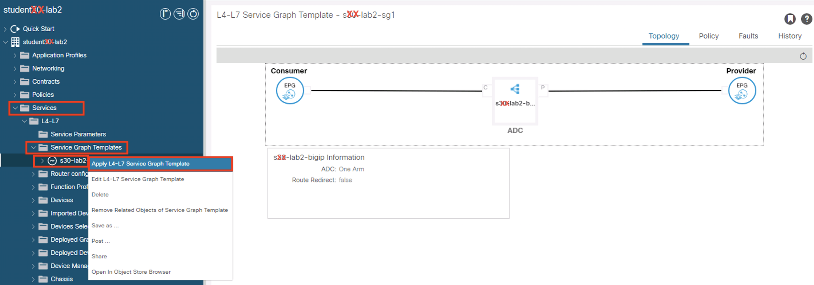
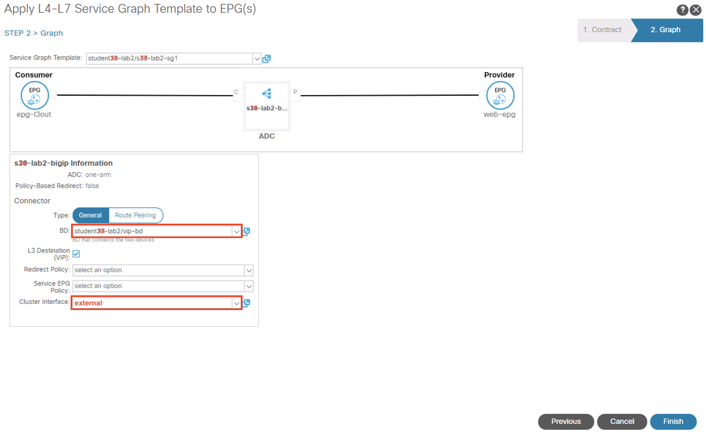
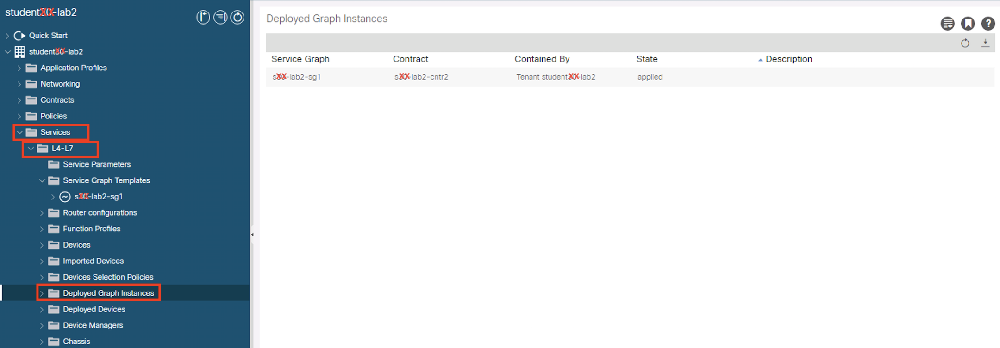
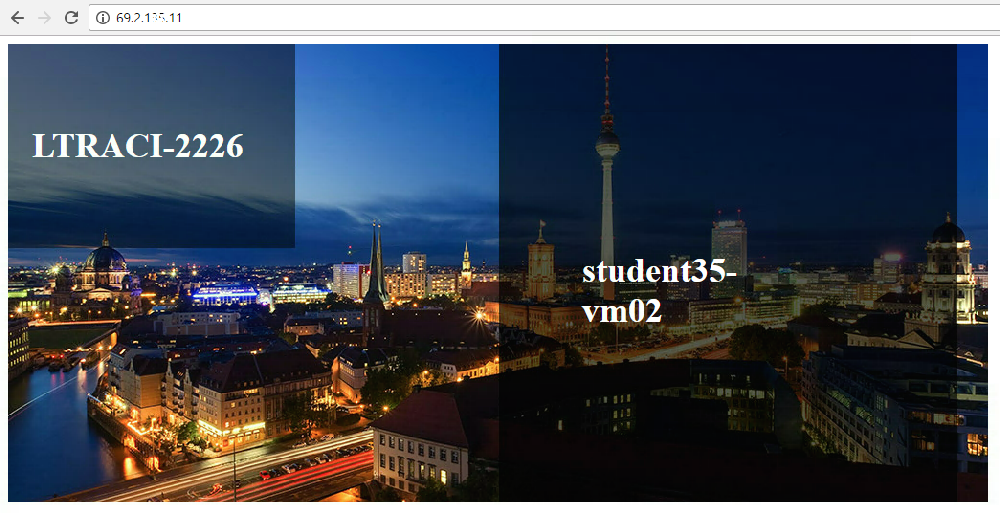

# Lab Exercise 2

Lab-2 will be used to demonstrate L4-L7 service insertion in managed mode with device manager to simulate an enterprise network and/or cloud provider’s application delivery offering while allowing the application owner to manage the L4-L7 device application template via a centralized device manager. 

We will use the F5 BIG-IP VE Virtual ADC and F5 iWorkflow workflow management tool to demonstrate this functionality.

## Verify the F5 BIG-IP iApps

F5 iApps is a user-customized framework for deploying application, providing a flexible way to automate tasks and templatize functionality on F5 devices.

Log into the F5 BIG-IP **{TBIGIPIP}** with the following username and password from the web browser:  
BIG-IP: **[https://{TBIGIPIP}](https://{TBIGIPIP})**  
Username: **admin**  
Password: **cisco123**  

After you have logged into the F5 BIG-IP GUI, you should see the following:

In the Navigation pane, click the **iApps -> Templates**. You should see the iApp template – _appsvcs\_integration\_v1.0\_001_ pre-loaded into the F5 BIG-IP:

>iApps to be used by iWorkflow / APIC integration must be exist in BIG-IP in order for iWorkflow to be discovered.

##Set up the F5 iWorkflow Cloud Management

Log into the F5 iWorkflow **{TBIGIQIP}** with the following username and password from the web browser:  
iWorkflow: **[https://{TBIGIQIP}](https://{TBIGIQIP})**  
Username: **admin**  
Password: **cisco123**  
	
After you have logged into the F5 iWorkflow GUI, you should see the following:

Click on the icon **Device** to enable a drop down, then select **Cloud** to switch to the Cloud configuration menu:

After switching to the Cloud configuration menu, you should see the following:

At this point, you are ready to register the F5 BIG-IP with the F5 iWorkflow. In order to do this, you will need to move the mouse to the left or right side (the iWorkflow has a dynamic interface) of the screen and then the Cloud Devices menu should appear. Select **Devices**:

Move the mouse over to **Devices** menu and click the **+** and **Discover Device** to register the F5 BIG-IP with your F5 iWorkflow and Cloud Management

Once you are in the **Devices** menu, you can register the F5 BIG-IP by using the BIG-IP’s IP address and credential as the following:  

IP Address: **{TBIGIPIP}**  
Username: **admin**  
Password: **cisco123**  
	
Click Save to register the BIP IP device:

You can now double click the registered BIG-IP and verify its status. It should say **_Available_** when the BIG-IP is communicating with the iWorkflow:

After BIG-IP is successfully discovered by iWorkflow, the iApp resides on BIG-IP are now exposed to iWorkflow. You can now create a template based on iApps.

Move your mouse to the left or right side of the screen and the Cloud **Catalog** menu should appear:

Next, select **Catalog**. When the Catalog menu appears on the screen, click **+** to continue:

A New Template screen will appear as the following:

Enter and select the following in the New Template:  
Name: **{TSTUDENT}-http-no-persistence**  
Input Parameters: **All Options**  
Application Type: **appsvcs\_integration\_v1.0\_001**  

  

You can now edit all the available options that need to be included with this template.  

Expand the _**Virtual Server Listener & Pool Configuration**_ by clicking the **>**. Scroll down and **CHECK** the following to make them **Tenant Editable**. What this does is allow the parameters supported by the iWorkflow device package to expose the parameters to APIC. If desired, we can limit what is exposed via a custom device package (this reduces the complexity). It is highly recommended to expose only what is needed to APIC:

**pool__addr**  
**pool__port**

Expand the **pool__Members** by clicking the **>** to allow additional items to be editable in APIC. Scroll down and **CHECK** the following to make them **Tenant Editable**:  
**Port**

Scroll down and expand the _**Virtual Server Configuration**_ by clicking **>** to remove the default settings of the following to **EMPTY** (Tenant Editable is already **UNCHECK**):

**vs__ProfileDefaultPersist**  
**vs__ProfileFallbackPersist**

>This is just used for our lab scenario to show the BIG-IP will load share all the connections between the Web servers. For a real live deployment scenario, you should always consult with the application owner before editing.

Click **Save** to complete the template:

Now, the newly created device package template is ready to be consumed by the APIC. The next step is to create the Cloud connectors which will generate a custom device package using this template as an APIC service function. Move your mouse to the left / right side of the screen to make the **Clouds** menu to appear

To create a new Connectors, move the mouse to the **Clouds** menu and the **+** should appear.

Click the **+** to enter a new cloud connector. Enter and select the following to complete the creation of the Cloud connectors:  
Name: **{TSTUDENT}**  
Cloud Provider: **Cisco APIC**  

Click **Save** to finish.

Now, move your mouse to the Cloud connectors menu and double click the **{TSTUDENT}** cloud connector. At this point, the **{TSTUDENT}** connector should expand and it should allow you to save the custom device package to your remote desktop.

Click the Download Device Package **F5DevicePackage.zip** to save the custom device package to your desktop.

##Import the Custom Device Package

Switch to your APIC GUI and click the following to upload the device package:  
**L4-L7 Services -> Packages -> L4-L7 Service Device Type**  
	
Click the **ACTIONS** button at the Work pane and choose **IMPORT DEVICE PACKAGE**  

A new pop-up should appear to allow you to choose the device package to be installed:

Click **BROWSE** and choose the previous downloaded device package - **F5DevicePackage.zip** from your desktop and click **SUBMIT** to upload the device package.

Now, you should see the following:

##Create the L4-L7 Device Manager
The F5 iWorkflow is a device manager used to manage the F5 Big-IP ADC. In the APIC GUI, click the following to configure the Device Manager:  
**L4-L7 Services -> Inventory -> Device Manager Type**  

Click the **ACTIONS** button at the Work pane and choose **Create Device Manager Type**

A new pop-up should appear to allow you to enter the device manager information. Enter the following information:

Vendor: **F5**  
Model: **iWorkflow**  
Version: **2.0-{TSTUDENT}**  
L4-L7 Service Device Type: **F5-iWorkflow-2.0-{TSTUDENT}**  
Device Manager: **Leave this field empty**

>It is extremely important to match the **Version** with the name of **L4-L7 Service Device Type** excluding the string - "**F5-iWorkflow-**".  

Click **SUBMIT** to accept the configuration.

The Device Manager is now registered with the APIC and we need to associate this with your tenant. 

>**Switch to {TSTUDENT}-lab2 tenant when you reach this step** 

Navigate to your tenant to create a new L4-L7 Device Manager by clicking the following:  
**Tenants {TSTUDENT}-lab2 -> L4-L7 Services -> Device Managers**  

In the Work pane, click:
**ACTIONS -> Create Device Manager**  

A new pop-up should appear to allow you to Create  Device Manager in your tenant. Enter the following information:

Device Manager Name: **device-manager-{TSTUDENT}**  
Management EPG: **Leave this field empty since we use OOB to communicate**  
Device Manager Type: **F5-iWorkflow-2.0-{TSTUDENT}**  

Click the **+** to enter the device manager Management connectivity information:  
Host: **{TBIGIQIP}**  
Port: **443**  

Click **UPDATE** to accept.

Enter the Device Manager's login credential:  
Username: **admin**  
Password: **cisco123**  
Confirm Password: **cisco123**  

Click **SUBMIT** to accept the configuration.

Navigate to your tenant to confirm the Device Manager is created correctly:
**Tenants {TSTUDENT}-lab2 -> L4-L7 Services -> Device Manager -> device-manager-{TSTUDENT}**  

##Create the L4-L7 Device for Service

Navigate to your tenant to create a new L4-L7 Device by clicking the following:  
**Tenants {TSTUDENT}-lab2 -> L4-L7 Services -> L4-L7 Devices**  

In the Work pane, click:  
**ACTIONS -> Create L4-L7 Devices**  
	

A new window should appear for you to create the L4-L7 Devices.

In the Create L4-L7 Devices window, enter the following:  
Managed: **CHECK**  
Name: **{TSNUM}-lab2-bigip**  
Service Type: **ADC**  
Device Type: **Virtual**  
VMM Domain, click the down arrow to select:  **CLBerlin2016**  
Mode: **Single Node**  
Device Package: **F5-iWorkflow-2.0–{TSTUDENT}**  
Model: **Unknown (Manual)**  
Context Aware: **Single**  
APIC to Device Management Connectivity: **Out-Of-Band**  
Username: **admin**  
Password: **cisco123**  
Confirm Password: **cisco123**  
	

In the _**Device 1**_, enter the following:  
Management IP Address: **{TBIGIPIP}**  
VM: Click the down arrow and select **CLBerlin2016/{TBIGIPVM}**  
Management Port: **https**  

Click the **+** to add a Device Interface:  
Name: **1_1**  
VNIC: **Network adapter 2**  

Click **UPDATE** to accept the Device Interface configuration.  

Normally, we will accept the _**Cluster Management IP**_, which is the same as the Device 1’s management IP. However, since we are going to use the iWorkflow to manage BIG-IP, the _Cluster IP will be changed to the iWorkflow’s IP_. The device will eventually ignore this setting and it will use the Device Manager information configured earlier to establish communication .  
Management IP Address: **{TBIGIQIP}**  
Management Port: **https**  
Device Manager: **{TSTUDENT}-lab2/device-manager-{TSTUDENT}**  

Click the **+** to add the first Logical Interface:  
Type: **consumer**  
Name: **external**  
Concrete Interface: **Device1/1_1**  

Click **UPDATE** to accept the consumer interface configuration.  

Click the **+** to add the second Logical Interface:  
Type: **provider**  
Name: **internal**  
Concrete Interface: **Device1/1_1**  

Click **UPDATE** to accept the consumer interface configuration.  

Why am I associating both consumer and provider interface to the same concrete interface? We are doing this because we are using the ADC in one-arm mode. There is only one interface!  

Click **NEXT** to accept the **Step 1 > General**.  

We would like to set up some basic information on the Big-IP by choosing the **All Parameters** tab.  

Click **>** to expand the field **Device Host Configuration** and enter the following parameters and click **UPDATE** to save the change:
Host Name: **{TBIGIPVM}.lab.test.local**  
NTP Server: **172.21.208.254**

  

Click **FINISH** to accept the **Step 2 > Device Configuration**.

Navigate to the newly created L4-L7 Device to verify its Configuration State is stable:
	**Tenants {TSTUDENT}-lab2 -> L4-L7 Services -> L4-L7 Devices -> {TSNUM}-lab2-bigip**

In the Work pane, ensure the _Configuration State_ is _stable_, if the device is not stable, click the Faults tab and ensure no faults or all the faults are in clearing state.

##Create L4-L7 Service Graph Templates

At this point, we are ready to create the L4-L7 Service Graph Template for the BIG-IP node.

To create a new Service Graph Template, click the following in the navigation pane:  
**Tenants {TSTUDENT}-lab2 -> L4-L7 Services -> L4-L7 Service Graph Template**  

In the Work pane:  
**ACTIONS -> Create L4-L7 Service Graph Template**  

In the new window, enter the following:  
Graph Name: **{TSNUM}-lab2-sg2**  
Graph Type: **Create a New One (should be the default)**  

Now, drag the Device Clusters to the right side of the window into the graph. You should be able to place the Node **{TSTUDENT}-lab2/{TSTUDENT}-bigip** between the **Consumer** EPG and the **Provider** EPG.  

Double click the word **N1** under the Node to change the name to **ADC**.  

Under **{TSTUDENT}-bigip** Information, click the **One-Arm** option for this graph.  

Select the Profile: **F5-iWorkflow-2.0–{TSTUDENT}/{TSTUDENT}-http-no-persistence**  

Click **SUBMIT** to continue.  

The new ADC L4-L7 Service Graph Template is now created and we are ready to deploy the BIG-IP with the pre-created **epg-l3out** and **web-epg** EPG.  

Let’s go back to the L4-L7 Service Graph Template and edit the Connections setting by clicking the following in the Navigation pane of your tenant:  
**Tenant {TSTUDENT} -> L4-L7 Services -> L4-L7 Service Graph Template  {TSNUM}-lab2-sg2**  
	

You can modify the Connections **C1** and **C2** to L3 Under Properties. C1 is the connector between the services device facing toward to the provider EPG, and C2 is the connector between the services device facing toward to the consumer EPG. In this case, the connection facing toward to a BD with subnet configured. Additionally, in ADC one-arm mode, there is only one connector facing both consumer and provider and we have to make the **Adjacency Type** the same.

C1 Adjacency Type: **L3**  
Click **UPDATE**  
C2 Adjacency Type: **L3**  
Click **UPDATE**  
Click **SUBMIT** to accept the change  
	

##Deploy the Service Graph Part 1

To deploy the service graph, click the following in the Navigation pane of your tenant:  
**Tenants {TSTUDENT}-lab2 -> L4-L7 Services -> L4-L7 Service Graph Template**

Select the Service Graph Template you just created from the Work pane. Right click and choose the option to **Apply L4-L7 Service Graph Template**.  

In the new window, you will have the ability to choose which EPGs the Service Graph will be inserted in between. Select the following for the EPG information:  
Consumer EPG / External Network: **{TSTUDENT}-lab2/{TSTUDENT}-lab2-l3out/epg-l3out**  
Provider EPG / External Network: **{TSTUDENT}-lab2/app/epg-web-epg**  

Under Contract Information, use the option to create a new Contract:  
	Create a New Contract: **SELECTED**  
	Contract Name: **{TSNUM}-lab2-cntr2**  
	No Filter (Allow All Traffic): **CHECKED**  
	

Click **NEXT** to continue to the next screen.

##Deploy the Service Graph Part 2

A new window to apply the service graph template will now appear. This window will show the Service Graph Template that you created earlier. 

In addition to the Service Graph Template, there are some options that need to be selected to deploy the BIG-IP with a Service Graph. Under the **{TSTUDENT}-lab2/{TSNUM}-lab2-sg2** Information, you need to choose the appropriate connector information:

Under the Connector, choose the following:  
	Type: **General**  
	BD: **{TSTUDENT}-lab2/web-bd**  
	Cluster Interface: **internal**  

Click **NEXT** to continue to the next screen.

##Deploy the Service Graph Part 3

A new window for the BIG-IP parameters will now appear. In this window, you will have the ability to modify the parameters to be deployed to the BIG-IP. Let’s modify some parameters to push the Service Graph into the BIG-IP.

Under Feature, it should be selected All. And the Parameters should be All Parameters.

Once you click the All Parameters tab, the folder and parameters will appear. To edit the parameter, you need to expand the parameter by clicking the **>** and double the field to change the parameter’s name and value. Let’s edit the following parameters:  
Under **Device Config**  
Press **>** to expand the **Network** configuration folder  
Press **>** to expand the folder **InternalSelfIP**   
Double click the parameter **Enable Floating?** and select **No** as the value  
Click **UPDATE** to apply  
Double click the parameter **Internal Self IP Address** and enter **{TL2F5INTSIP}** as the value  
Click **UPDATE** to apply  
Double click the parameter **Internal Self IP Netmask** and enter **255.255.255.0** as the value  
Click **UPDATE** to apply  
Double click the parameter **Port Lockdown** and select **Default** as the value  
Click **UPDATE** to apply  

Press **>** to expand the folder **Route**  
Double click the parameter **Destination IP Address** and enter **0.0.0.0** as the value  
Click **UPDATE** to apply  
Double click the parameter **Destination Netmask** and enter **0.0.0.0** as the value  
Click **UPDATE** to apply  
Double click the parameter **Next Hop Router IP Address** and enter **{TVM2GW}** as the value  
Click **UPDATE** to apply  

Under **Function Config**  
Press **>** to expand the **NetworkRelation** configuration folder  
Double click the parameter **Select Network** and select **Network** as the network relation  
Click **UPDATE** to apply  

Under **Function Config**  
	Press **>** to expand the **{TSTUDENT}-http-no-persistence-Default** configuration folder  
	Double click on the name and delete **Default**  
Click **UPDATE** to apply  
	Press **>** to expand the **Pool Members** folder  
	Press **>** to expand the **Member** folder  
Double click to enter value into the **IPAddress** field: **{TVM2IP}**  
Click **UPDATE** to apply  
Double click the parameter **Port** to accept the TCP port: **80**  
Click **UPDATE** to apply  

Press the **+** on the left side next to the **Member** folder to add a new member  
Click **UPDATE** to accept the name  

Press **>** to expand the **Member** folder (the name will be populated as **member2**)  
Double click to enter value into the **IPAddress** field: **{TVM3IP}**  
Click **UPDATE** to apply  
Double click the parameter **Port** and enter the TCP port: **80**  
Click **UPDATE** to apply  

Back to the **{TSTUDENT}-http-no-presist** configuration folder  
Double click to enter value into the **Address** field (Name **pool_addr**): **{TL2F5VIP}**  
Click **UPDATE** to apply  
Double click the parameter **Port** to accept the TCP port: **80**  
Click **UPDATE** to apply  

Click **FINISH** to finish the configuration of the BIG-IP parameters  

  

##Verifying the BIG-IP service graph deployment

You can now verify if APIC has deployed the service graph correctly. First, navigate the following:  
**Tenant {TSTUDENT}-lab2 -> L4-L7 Services -> Deployed Devices**  

You should be able to see a screen similar to the following. The State should say **_allocated_**.  

Next, you can navigate:  
**Tenant {TSTUDENT}-lab1 -> L4-L7 Services -> Deployed Graph Instances**  

The Deployed Graph Instances state should say **_applied_**.  

##Verifying the BIG-IP service graph deployment

Log into the F5 iWorkflow **{TBIGIQIP}** with the following username and password from the web browser (if the previous session has timed out):  
iWorkflow: **[https://{TBIGIQIP}](https://{TBIGIQIP})**  
Username: **admin**  
Password: **cisco123**  

Under the iWorkflow **_Cloud_** configuration. In the Work pane, under **Services** and **Servers**, you should see the deployed application, real servers and APIC tenant name listed similar to the following:

Double click on the **_Services_** and you should see the screen similar to the following:

>Note - the Services name will contain the deployed partition number in BIG-IP is the same as the APIC virtual device number. 

You can also see the Status of the services says **_Application Service is healthy_**. The Application Type is the Catalog template we have created earlier, **{TSTUDENT}-http-no-persistence** with the cloud connector as your student number, **{TSTUDENT}**. 

Under the Application Template, you will see the Pool Addr in the notation of the VIP plus the Route-Domain (VRF): **{TL2F5VIP} 80**

The Pool Members are the real servers’ IP, **{TVM2IP}** and **{TVM3IP}** and listening port, in our case, it is port **80**.

Now, let’s log into the F5 BIG-IP **{TBIGIPIP}** with the following username and password from the web browser (if the previous session has timed out):  
BIG-IP: **[https://{TBIGIPIP}](https://{TBIGIPIP})**  
Username: **admin**  
Password: **cisco123**  

On the **Main** menu, click **Local Traffic -> Traffic Map**. Then on the top right corner, next to the **_Log out_** button, click the drop down to select the newly created **Partition** (please note that this reflects the APIC Virtual Device ID):  

Once you are in the partition, click **Local Traffic -> Network Map**. You should be able to see the virtual server is in green along with its pool and pool members.

On the right Navigation menu, click the **Local Traffic -> Virtual Servers** and you should be able to see the brief Virtual IP information. You can see that the VIP is currently listening on HTTP port 80.

The number (in this example, **_867_** ) after the **_%_** mark represents the route domain (RD) number.  There will be a RD number assign to each APIC partition, which equivalent to an ACI L3 VRF.  This allows BIG-IP to provide multi-tenancy support in ACI environment.

In the **Virtual Server List**, click the **Name** in the hyperlink and you will see the **Property** of the Virtual Server with more detailed information. The configured the parameters will appear here.

Click the **Resources** tab and you should see the both **Default** and **Fallback** persistence profiles are set to **None**.  

>Remember we did this at the iWorkflow?

Click **Local Traffic -> Pools** and you should see the brief information of the real server pool information:

Click the hyperlink under **Name** and you should be directed to the Pool **Properties** page. Now click the **Members** tab and you should see the real servers (pool members) we configured when we were deploying the service graph.

Let’s go back to the Navigation pane and click the **iApps -> Application Services**, you should see the **Application Services List** and the iApp template we were using earlier.

Click the hyperlink in **Name** and you will be directed to the Application Services **Components**. By using iApps template, you can configure a full features virtual server by specifying customized parameters exposed to APIC.

Go to your RDP command line and ping **{TL2F5VIP}** (VIP). This should succeed.

You can now verify the Virtual Server (or VIP) by using your browser and entering the VIP into the address window:  
	URL: **[http://{TL2F5VIP}](http://{TL2F5VIP})**  
	

If you press the enter button (do not use the refresh button of your browser) at the IP address **{TL2F5VIP}** at the web browser, you should see a different page. You can repeat this multiple time to see the page load balanced between different web servers.

>**Congratulations! This session of the lab is completed, please process to the Bonus Lab session via the menu**