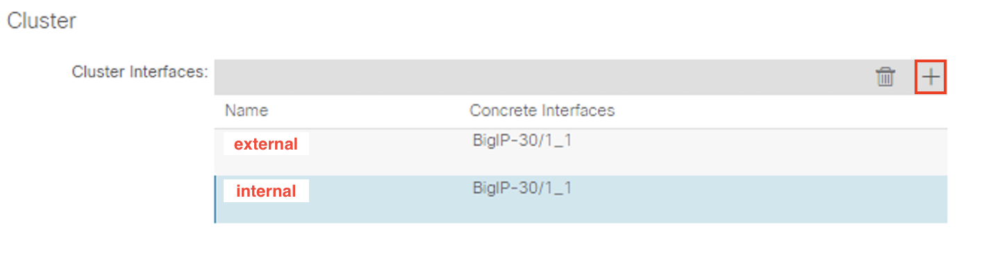
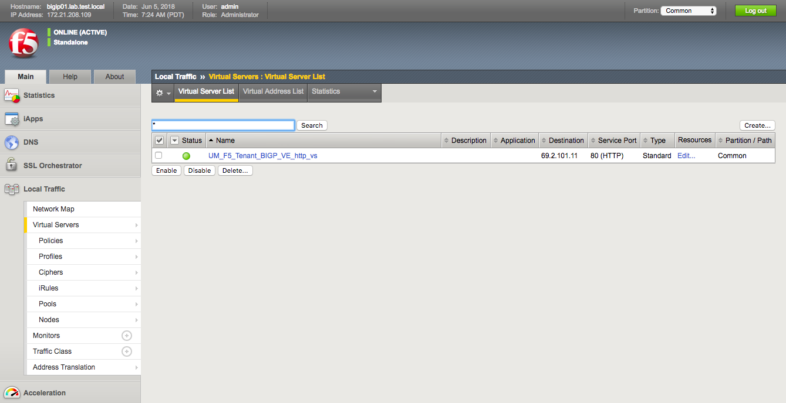

# Lab Exercise 2

>**Please note that the images used in the lab guide are representative and NOT based on any specific pod. Please use the information in the lab guide instead.**

Lab-2 will be used to demonstrate L4-L7 service insertion in unmanaged mode to simulate an enterprise network and/or cloud provider’s application delivery offering while allowing the application owner to manage the L4-L7 device using their prefered tool. 

We will use the F5 BIG-IP VE Virtual ADC to demonstrate this functionality.

Different from the previous CiscoLive, we will demonstrate the Policy-Based Redirect feature that was introduced in APIC version 2.0 in this lab exercise.


##Create the Unmanaged L4-L7 Device

In the navigation pane, click the following:
  
**Tenant {TSTUDENT}-lab2 -> Services -> L4-L7 -> Devices**  

Click the following in the Work pane to create a new unmanaged L4-L7 logical device.
  
**ACTIONS -> Create L4-L7 Devices**  


A new window should appear which will allow you to create the L4-L7 Devices.  


In the Create L4-L7 Devices window, enter the following:
  
* Managed: **UNCHECK**  

> When Managed is unchecked, the number of field of the Logical Device should be reduced  

* Name: **{TSNUM}-lab2-bigip**  
* Service Type: click the down arrow to select: **ADC**  
* Device Type: **Virtual**  
* VMM Domain: click the down arrow to select: **VMware/CLBerlin2016** 
* View: **Single Node**
* Promiscous Mode: **UNCHECK** 
* Context Aware: **Single**  
* Function Type: **GoTo**  
	


In the **Device 1**, click the down arrow to select the proper virtual machine: 

* **DMZ_VC/{TBIGIPVM}**  

Click the **+** to add the **Concrete Interface**.  


Enter the following for the first interface:  

* Name: **1_1**  
* VNIC: click the down arrow to select: **Network adapter 2**  
* Path (Only For Route Peering): _**Leave this field empty**_  

Click **UPDATE** to accept the interface’s configuration.


In the **Cluster Interface** field, click the **+** to add the **Cluster Interfaces**.

To map the first **Concrete interfaces** to the **Logical interfaces**, do the following:  

* Name: **consumer**  
* Concrete Interface: click the down arrow to select: **Device1/1_1**  

Click **UPDATE** to accept the first logical interface’s configuration

In the **Cluster Interface** field, click the **+** to add the second Cluster Interfaces.  

To map the second **Concrete interfaces** to the **Logical interfaces**, enter the following:  

* Name: **provider**  
* Concrete Interface: click the down arrow to select: **Device1/1_1**  

Click **UPDATE** to accept the second logical interface’s configuration.



Click **FINISH** to accept the L4-L7 Devices configuration.

##Provisioning the BIGIP using Ansible

We will provision the ADC using Ansible for a couple of reasons. Ansible is an open source automation platform that can help with configuration management, application deployment, and task automation. It can also do IT orchestration, where you have to run tasks in sequence and create a chain of events which must happen on several different servers or devices.

Red Hat Ansible Tower provides a single point of control your IT infrastructure with a visual dashboard, role-based access control, job scheduling, integrated notifications and graphical inventory management. 

Connect to the Ansible tower using the following information:

* **Ansible Tower Address**: 172.21.208.250
* **username**: {TSTUDENT}
* **password**: cisco123


Once you are logged in click on **Templates** located in the top level menu: 


Click on the template **podxx**. There is a ansible playbook associated with the template. When the template is launched, the playbook will be executed


The playbook in this case is stored on the Ansible Tower itself (you cannot view the contents from the tower UI). Contents of the playbook are as follows:

```
- name: Standalone Virtual Unmanaged Mode BIG-IP setup
  hosts: localhost
  connection: local
  gather_facts: false

  vars_files:
    - variable.yaml

  tasks:

  - name: Add VLAN(s)
    #Name of the ansible module
    bigip_vlan: 
      server: "{{bigip_ip}}"
      user: "{{ bigip_username }}"
      password: "{{ bigip_password }}"
      name: "{{tenant_name_aci}}_{{item.name}}"
      tag: "{{item.id}}"
      untagged_interfaces:
      - "{{item.interface}}"
      validate_certs: "no"
    with_items: "{{vlan_information}}"

  - name: Add SELF-IP(s)
    bigip_selfip:
     server: "{{bigip_ip}}"
     user: "{{ bigip_username }}"
     password: "{{ bigip_password }}"
     name: "{{tenant_name_aci}}_{{item.name}}"
     address: "{{item.address}}"
     netmask: "{{item.netmask}}"
     vlan: "{{tenant_name_aci}}_{{item.vlan}}"
     validate_certs: "no"
    with_items: "{{ bigip_selfip_information }}"

  - name: Add route(s)
    bigip_static_route:
      server: "{{bigip_ip}}"
      user: "{{ bigip_username }}"
      password: "{{ bigip_password }}"
      name: "{{item.name}}"
      gateway_address: "{{item.gw_address}}"
      netmask: "{{item.netmask}}"
      destination: "{{item.destination}}"
      validate_certs: "no"
    with_items: "{{static_route}}"
    delegate_to: localhost

  - name: Create nodes
    bigip_node:
      server: "{{ bigip_ip }}"
      user: "{{ bigip_username }}"
      password: "{{ bigip_password }}"
      host: "{{item.host}}"
      name: "{{item.host}}"
      validate_certs: "no"
    with_items: "{{pool_members}}"
    delegate_to: localhost

  - name: Create pool
    bigip_pool:
      server: "{{ bigip_ip }}"
      user: "{{ bigip_username }}"
      password: "{{ bigip_password }}"
      name: "{{tenant_name_aci}}_{{pool_name}}"
      lb_method: "round-robin"
      monitors: "/Common/http"
      monitor_type: "and_list"
      validate_certs: "no"
    delegate_to: localhost

  - name: Add Pool members
    bigip_pool_member:
      server: "{{ bigip_ip }}"
      user: "{{ bigip_username }}"
      password: "{{ bigip_password }}"
      state: "present"
      name: "{{item.host}}"
      host: "{{item.host}}"
      port: "{{item.port}}"
      pool: "{{tenant_name_aci}}_{{pool_name}}"
      validate_certs: "no"
    with_items: "{{pool_members}}"
    delegate_to: localhost

  - name: Add Virtual Server
    bigip_virtual_server:
      server: "{{ bigip_ip }}"
      user: "{{ bigip_username }}"
      password: "{{ bigip_password }}"
      name: "{{tenant_name_aci}}_{{ldev_name_aci}}_{{vip_name}}"
      destination: "{{vip_ip}}"
      port: "{{vip_port}}"
      enabled_vlans:
       - "{{tenant_name_aci}}_{{vlan_information[0]['name']}}"
      all_profiles:
       - http
      pool: "{{tenant_name_aci}}_{{pool_name}}"
      snat: "{{snat}}"
      validate_certs: "no"
    delegate_to: localhost
```

Any content with the {{}} is a variable that is being substitued from a variable file. Example variable file: 

```
hostname: 'bigipve.local'
student: 'studentxx'

#APIC information
tenant_name_aci: "UM_F5_Tenant"
ldev_name_aci: "BIGP_VE"

# Network information
bigip_ip: "172.21.208.111"
bigip_username: "admin"
bigip_password: "cisco123"

vlan_information:
- name: "Internal_VLAN"
  id: "1234"
  interface: "1.1"

bigip_selfip_information:
- name: 'Internal-SelfIP'
  address: '69.2.103.10'
  netmask: '255.255.255.0'
  vlan: "{{vlan_information[0]['name']}}"

static_route:
- name: "default"
  gw_address: "69.2.103.1"
  destination: "0.0.0.0"
  netmask: "0.0.0.0"

vip_name: "http_vs"
vip_port: "80"
vip_ip: "69.2.103.11"
snat: "Automap" #Options: none/automap/snat-pool name

pool_name: "web-pool"
pool_members:
- port: "80"
  host: "69.2.3.100"
- port: "80"
  host: "69.2.3.101"

```
Click on the rocket icon to execute the playbook to provision the BIGIP: 


After a few seconds the playbook is executed and the status changes from **Running** to **Sucessful**. 


## Verifying the BIG-IP Deployment

Let’s log into the F5 BIG-IP **{TBIGIPIP}** with the following username and password from the web browser (if the previous session has timed out): 
 
* BIG-IP: **[https://{TBIGIPIP}](https://{TBIGIPIP})**  
* Username: **admin**  
* Password: **cisco123**  


On the **Main** menu click **Local Traffic -> Network Map**. You should be able to see the virtual server is created along with its pool and pool members.


On the left Navigation menu, click the **Local Traffic -> Virtual Servers** and you should be able to see the brief Virtual IP information. You can see that the VIP is currently listening on HTTP port 80.


In the **Virtual Server List**, click the **Name** in the hyperlink and you will see the **Property** of the Virtual Server with more detailed information. The configured the parameters will appear here. 


Click the **Resources** tab and you should see the both **Default** and **Fallback** persistence profiles are set to **None**.  


Click **Local Traffic -> Pools** and you should see the brief information of the real server pool information:


Click the hyperlink under **Name** and you should be directed to the Pool **Properties** page. Now click the **Members** tab and you should see the real servers (pool members) we configured when we were deploying the service graph.


## Configuring the BIG-IP Service Graph Deployment with Policy-Based Redirect (PBR)

ACI Policy Based Redirection for Service Insertion (PBR) is a feature that was introduced in APIC 2.0.1 and later releases. One of the neat use case of this feature is one-arm mode ADC design without SNAT.

One-arm mode ADC requires Source NAT (SNAT) configuration when the servers are not using ADC interface IP as their default gateway or in different bridge domain/IP subnets, in order for returning traffic to pass through ADC. Servers do not have clients' true source IP information for logging with SNAT configuration.

ACI PBR feature enables one-arm mode ADC design w/o SNAT configuration by redirecting the returning traffic from servers based on policy configuration. this enables more flexible servers placement and allows servers to have clients' true source IP information for logging.

Let's configure the ACI fabric and the ADC to see how Policy-Based Redirect in action.

In order to configure policy-based redirect, we need to disable the **Endpoint Dataplane Learning** under the **vip-bd**. To preserve the client's real IP, the client's real IP will remain the same after the packet is load balanced by the ADC. If dataplane learning is enabled, the COOP database will program the leaf where the ADC is connected to with the client's IP and this will cause communication issue between the client and other EPs in the ACI fabric. 

In the APIC GUI, click the following:  

* Navigate to **Tenants {TSTUDENT}-lab2 -> Networking -> Bridge Domains -> vip-bd -> Policy**  
* Uncheck **Endpoint Dataplane Learning**  

  

Click **Submit** to accept the change.  

Next, we need to configure the policy-based redirect in the ACI fabric. First, we need to obtain the interface MAC address of the BIG-IP using the BIG-IP UI using:

BIG-IP: **[https://{TBIGIPIP}](https://{TBIGIPIP})**  
Username: **admin**  
Password: **cisco123**  

Click **Network -> Interfaces** and copy down the interface **1.1**'s **MAC Address**

  

When we are configuring the ACI Policy-Based Redirect, we need to enter the MAC address with an appending zero, such as **00:50:56:9c:ab:cd**.

>Please use the MAC Address from the BIG-IP UI. Do **NOT** copy the mac address from this guide.

In the APIC GUI, to configure policy-based redirect policy, navigate to the following:

Right click on **Tenants {TSTUDENT}-lab2 -> Policies -> Protocol -> L4-L7 Policy Based Redirect** and select **Create L4-L7 Policy Based Redirect**. 

  

In the new window appears in the Work pane enter the following:

* Name: **{TSTUDENT}-pbr**
* Enable POD ID Aware Redirection: **uncheck** 
* Hashing Algorithm: **sip-dip-prototype**
* Resilient Hashing Enabled: **uncheck**
* Enable Anycast: **uncheck**
* IP SLA Monitoring Policy: **leave blank** 


Click on the plus sign to add a destination of redirection: 

* IP: **{TL2F5INTSIP}**  
* MAC: **MAC-Address-You've-Recorded-Earlier-Starts-With-00** 
* Second IP: **leave blank** 
* POD ID: **1**
* Redirect Health Group: **leave blank**  

Click **Update** to accept the changes  


Click **Submit** to accept the configuration.

##Create L4-L7 Service Graph Templates

At this point, we are ready to create the L4-L7 Service Graph Template for the BIG-IP node.

To create a new Service Graph Template, click the following in the navigation pane:

**Tenants {TSTUDENT}-lab2 -> Services -> L4-L7 -> Service Graph Template**  

In the Work pane:
  
**ACTIONS -> Create L4-L7 Service Graph Template**  


In the new window, enter the following:  

* Graph Name: **{TSNUM}-lab2-sg2**  
* Graph Type: **Create a New Graph (should be the default)**


* Now drag the Device Clusters to the right side of the window into the graph. You should be able to place the Node **{TSTUDENT}-lab2/{TSTUDENT}-bigip** between the **Consumer** EPG and the **Provider** EPG.  
* Double click the word **N1** under the Node to change the name to **ADC**.  
* Under **{TSTUDENT}-bigip** Information, click the **One-Arm** option for this graph.  
* **Route Redirect**: **check it**  

Click **SUBMIT** to continue.  

Let’s go back to the L4-L7 Service Graph Template and edit the Connections setting by clicking the following in the Navigation pane of your tenant:
  
**Tenant {TSTUDENT} -> Services -> L4-L7 -> Service Graph Template -> {TSNUM}-lab2-sg2**  
	
You can check if Connections **C1** and **C2** are set to L3 Under Properties. C1 is the connector between the services device facing toward to the consumer EPG, and C2 is the connector between the services device facing toward to the provider EPG. In this case, the connection facing toward to a BD with subnet configured. Additionally, in ADC one-arm mode, there is only one connector facing both consumer and provider and we have to make the **Adjacency Type** the same.

Also make sure the Direct Connect is set to True for both connectors C1 and C2. Direct Connect must be set to True in order for health monitoring packets from ADC interface IP to reach server EPGs.

Click **SUBMIT** to accept the change  
	


The new ADC L4-L7 Service Graph Template is now created and we are ready to deploy the BIG-IP with the pre-created **epg-l3out**  and  **web-epg** EPG.  

##Deploy the Service Graph Part 1

To deploy the service graph, click the following in the Navigation pane of your tenant: 

**Tenants {TSTUDENT}-lab2 -> Services -> L4-L7 -> Service Graph Template**

Select the Service Graph Template you just created from the Work pane. Right click and choose the option to **Apply L4-L7 Service Graph Template**.  


In the new window, you will have the ability to choose which EPGs the Service Graph will be inserted between. Select the following for the EPG information:  

* Consumer EPG / External Network: **{TSTUDENT}-lab2/{TSTUDENT}-lab2-l3out/epg-l3out**  
* Provider EPG / External Network: **{TSTUDENT}-lab2/app/epg-web-epg**  

Under Contract Information, use the option to create a new Contract:
  
* Create a New Contract: **SELECTED**  
* Contract Name: **{TSNUM}-lab2-cntr2**  
* No Filter (Allow All Traffic): **CHECKED**  


Click **NEXT** to continue to the next screen.

##Deploy the Service Graph Part 2

A new window to apply the service graph template will now appear. This window will show the Service Graph Template that you created earlier. 

In addition to the Service Graph Template, there are some options that need to be selected to deploy the BIG-IP with a Service Graph. As illustrated in the beginning of this lab, the ADC will now be placed in its own Bridge Domain along with the load balancing VIP. Under the **{TSTUDENT}-lab2/{TSNUM}-lab2-sg2** information, you need to choose the appropriate connector information:

Under the Connector, choose the following:  

* Type: **General**  
* BD: **{TSTUDENT}-lab2/vip-bd**
* L3 Destination VIP: **leave checked**
* Redirect Policy: **{TSTUDENT}-pbr**
* Cluster Interface: **provider** 

Consumer connector side does not require PBR. 

##Verifying the BIG-IP Service Graph Deployment with Policy-Based Redirect on APIC

You can now verify if APIC has deployed the service graph with policy-based redirect correctly. Navigate to the following:  

**Tenant {TSTUDENT}-lab1 -> Services -> L4-L7 -> Deployed Graph Instances**   

You should be able to see a screen similar to the following. The State should say **_applied_**.  


Now, let’s log into the F5 BIG-IP **{TBIGIPIP}** with the following username and password from the web browser (if the previous session has timed out):  

* BIG-IP: **[https://{TBIGIPIP}](https://{TBIGIPIP})**  
* Username: **admin**  
* Password: **cisco123**  

On the **Main** menu, click **Local Traffic -> Network Map**. You should be able to see the virtual server is in green along with its pool and pool members.


On the right Navigation menu, click the **Local Traffic -> Virtual Servers** and you should be able to see the brief Virtual IP information. You can see that the VIP is currently listening on HTTP port 80.



In the **Virtual Server List**, click the **Name** in the hyperlink and you will see the **Properties** of the Virtual Server with more detailed information. Scroll down and you should notice the Source Address Translation option is set to **None**.


Click **Local Traffic -> Pools** and you should see the brief information of the real server pool information:


Click the hyperlink under **Name** and you should be directed to the Pool **Properties** page. Now click the **Members** tab and you should see the real servers (pool members).


Go to your RDP command line and ping **{TL2F5VIP}** (VIP). This should succeed.

You can now verify the Virtual Server (or VIP) by using your browser and entering the VIP into the address window:  

URL: **[http://{TL2F5VIP}](http://{TL2F5VIP})**  

You should see the page with the hostname of your VMs similar to the following:   
	


Press the enter button (do not use the refresh button of your browser) at the IP address **{TL2F5VIP}** at the web browser, you should see a different page and the VIP is load balanced by the ADC.


Now that we have verified connectivity to the web server via the ADC VIP, let's inspect the web server and see which client IP is in the access log.

Use the Putty SSH client in your RDP and connect to the first web server VM and verify its access log entries. For example, you can SSH into VM, {TSTUDENT}-vm02, via its L2 only network connection by using the following:

IP address: **{TVM2L2}**  
Username: **student**  
Password: **ciscolive.2018**  

After logged in, issue the following command:  

```
tail -f /var/log/httpd/access_log
```

You should see an output similar to the following:  

```
{TL2F5INTSIP} - - [06/Feb/2018:20:11:52 -0500] "GET /" 200 770 "-" "-"
{TL2F5INTSIP} - - [06/Feb/2018:20:11:56 -0500] "GET /" 200 770 "-" "-"
```

This is the HTTP health probe from the Big-IP. Let's use the web browser in your RDP session to browse the web server via the ADC VIP for multiple times. You should see the browser switch between VM2 and VM3.

Now, let's inspect the HTTP access log and you will notice an output similar to the following:  

```
199.253.253.12 - - [07/Feb/2017:22:29:07 -0500] "GET / HTTP/1.1" 200 770 "-" "Mozilla/5.0 (Windows NT 6.3; WOW64) AppleWebKit/537.36 (KHTML, like Gecko) Chrome/55.0.2883.87 Safari/537.36"
```  

The IP address in the HTTP access log contains the client's IP in the HTTP request. The ACI fabric uses the Policy-Based Redirect to return the response from the web server to the client. This is similar to the traditional network concept of Policy-Based Routing. 

>**Congratulations! This session of the lab is completed, please proceed to the next lab session via the menu**