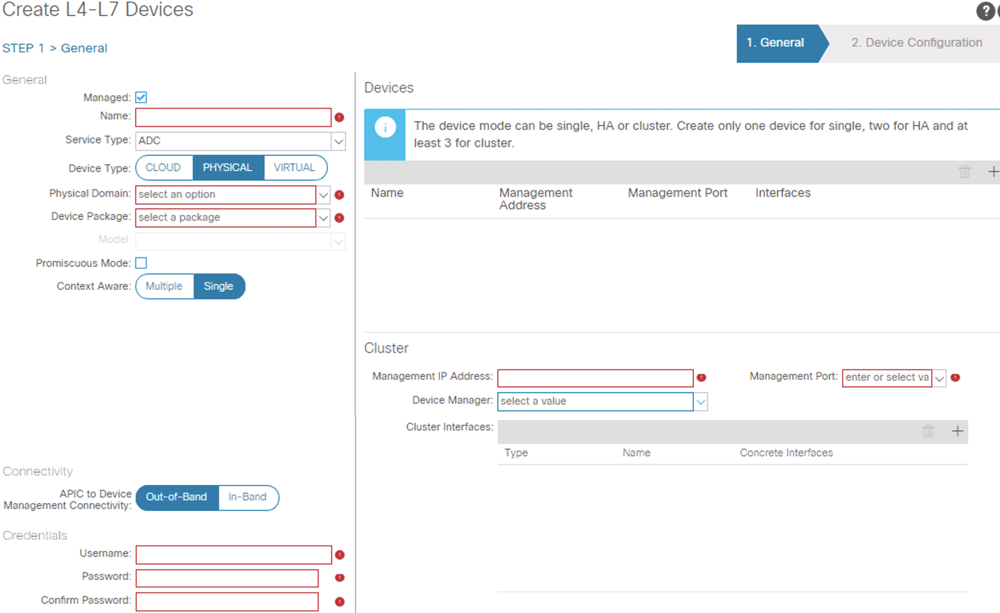
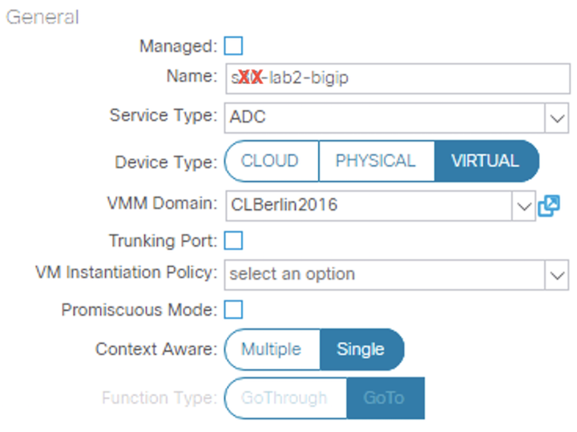
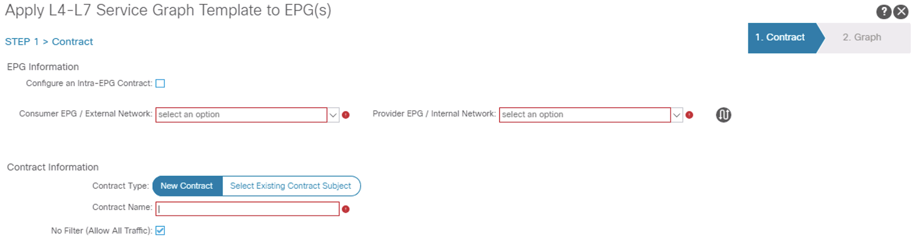
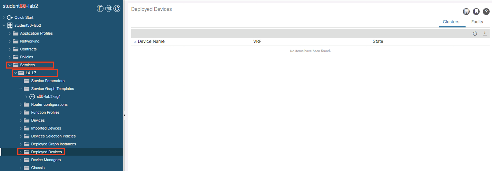
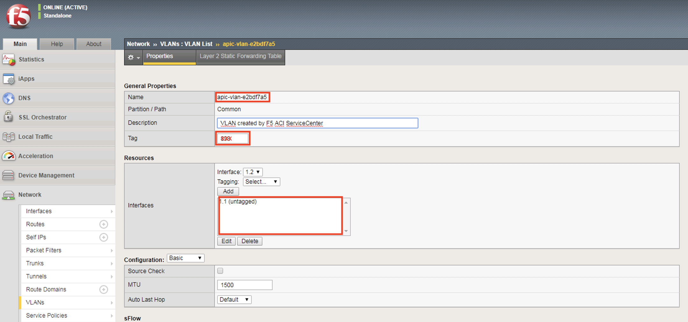
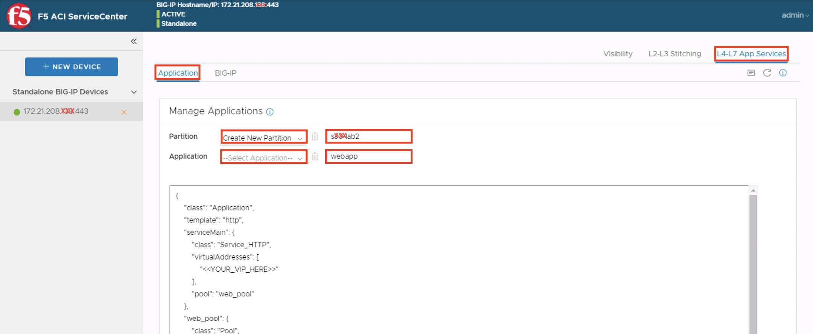
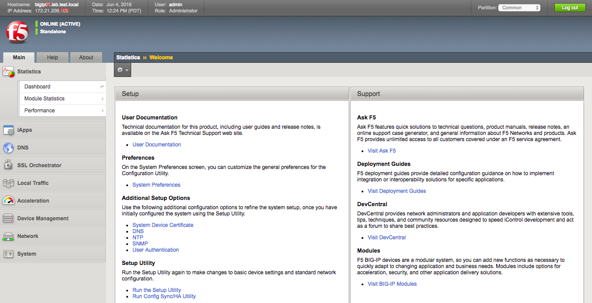
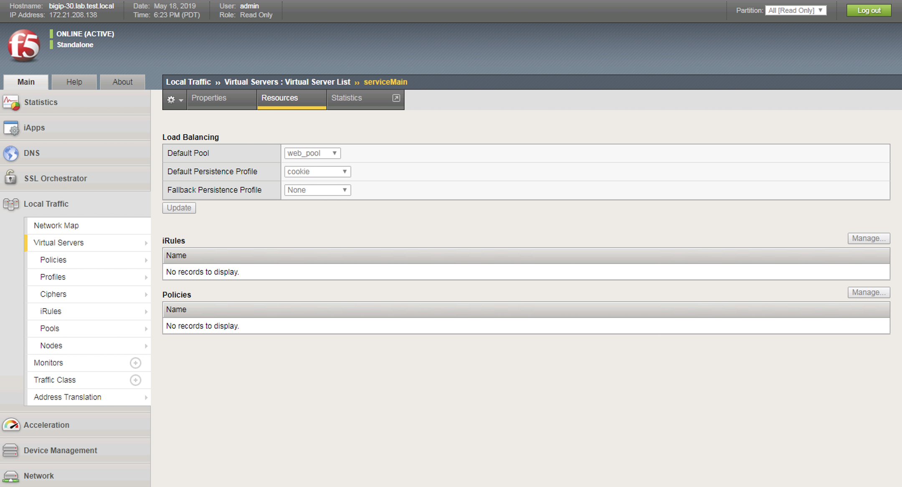
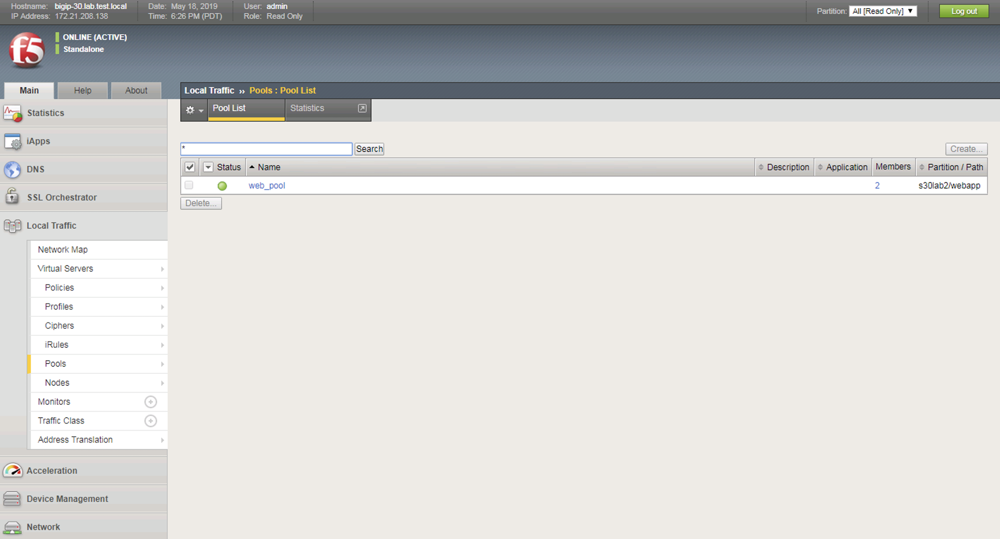

# Lab Exercise 2

>**Please note that the images used in the lab guide are representative and NOT based on any specific pod. Please use the information in the lab guide instead.**

Lab-2 will be used to demonstrate L4-L7 service insertion in unmanaged mode to simulate an enterprise network and/or cloud provider’s application delivery offering while allowing the application owner to manage the L4-L7 device using their prefered tool.  

We will use the F5 BIG-IP VE Virtual ADC to demonstrate this functionality.  

Different from the previous CiscoLive, we will demonstrate the F5 ACI App with Source NAT and Policy-Based Redirect feature in this lab exercise.  


##Accessing Lab 2

Navigate to your new Tenant {TSTUDENT}-lab2 by searching the Tenant in the **Tenant Search** tool box in the submenu bar:

Tenant Search: **{TSTUDENT}**


Click **{TSTUDENT}-lab2** and this will bring you to the lab 2 tenant.  

##Create the Unmanaged L4-L7 Device

In the navigation pane, click the following:  
  
**Tenant {TSTUDENT}-lab2 -> Services -> L4-L7 -> Devices**  

Click the following in the Work pane to create a new unmanaged L4-L7 logical device.
  
**ACTIONS -> Create L4-L7 Devices**  


A new window should appear which will allow you to create the L4-L7 Devices.  



In the Create L4-L7 Devices window, enter the following:
  
* Managed: **UNCHECK**  

> When Managed is unchecked, the number of field of the Logical Device should be reduced  

* Name: **{TSNUM}-lab2-bigip**  
* Service Type: click the down arrow to select: **ADC**  
* Device Type: **Virtual**  
* VMM Domain: click the down arrow to select: **VMware/CLBerlin2016**  
* Trunk Port: **UNCHECK**  
* VM Instantiation Policy: **EMPTY**  
* Promiscous Mode: **UNCHECK**  
* Context Aware: **Single**  
* Function Type: **GoTo**  
	
  

In the **Devices**, click the **+** on the right to add the BIG-IP virtual machine as the concrete device: 

  

A new pop-up window should appear and you can enter the VM name and select the proper concrete device:

* **{TBIGIPVM}**  
* **DMZ_VC/{TBIGIPVM}**  

  

Click the **Next** to add the **Concrete Interface**.  

Enter the following for the first interface:  

* Name: **1_1**  
* VNIC: click the down arrow to select: **Network adapter 2**  
* Path (Only For Route Peering): _**Leave this field empty**_  

Click **UPDATE** to accept the interface’s configuration.

Click **OK** to finish the Concrete Device configuration.  


In the **Cluster Interface** field, click the **+** to add the **Cluster Interfaces**.

To map the first **Concrete interfaces** to the **Logical interfaces**, do the following:  

* Name: **external**  
* Concrete Interface: click the down arrow to select: **{TBIGIPVM}/1_1**  

Click **UPDATE** to accept the first logical interface’s configuration

In the **Cluster Interface** field, click the **+** to add the second Cluster Interfaces.  

To map the second **Concrete interfaces** to the **Logical interfaces**, enter the following:  

* Name: **internal**  
* Concrete Interface: click the down arrow to select: **{TBIGIPVM}/1_1**  

Click **UPDATE** to accept the second logical interface’s configuration.


Click **FINISH** to accept the L4-L7 Devices configuration.

##Creating the L4-L7 Service Graph Template  

At this point, we are ready to create the L4-L7 Service Graph Template for the BIG-IP node.

To create a new Service Graph Template, click the following in the navigation pane:  
**Tenants {TSTUDENT}-lab2 -> Services -> L4-L7 Service Graph Template**  


In the Work pane:  
**ACTIONS -> Create L4-L7 Service Graph Template**  

In the new window, enter the following:  
Graph Name: **{TSNUM}-lab2-sg2**  
Graph Type: **Create a New One (should be the default)**  

Now, drag the Device Clusters to the right side of the window into the graph. You should be able to place the Node **{TSTUDENT}-lab2/{TSNUM}-lab2-bigip** between the **Consumer** EPG and the **Provider** EPG.  

Double click the word **N1** under the Node to change the name to **ADC** (optional).  

Under **{TSTUDENT}-bigip** Information, select **One-Arm** option for this graph.  
**Route Redirect**: leave it **UNCHECK** for now.  


Click **SUBMIT** to continue.  

The new ADC L4-L7 Service Graph Template is now created and we are ready to deploy the BIG-IP with the pre-created **epg-l3out** and **web-epg** EPG.  

Let’s go back to the L4-L7 Service Graph Template and review the Connections setting by clicking the following in the Navigation pane of your tenant:  
**Tenant {TSTUDENT} -> L4-L7 Services -> L4-L7 Service Graph Template  {TSNUM}-lab2-sg2**  
	


You can modify the Connections **C1** and **C2** to L3 Under Properties. Let's understand what these setting means:  

* C1 is the connector between the services device facing toward to the provider EPG, and  
* C2 is the connector between the services device facing toward to the consumer EPG. 

In this case, the connection facing toward to a BD with subnet configured, hence L3. Additionally, in ADC one-arm mode, there is only one connector facing both consumer and provider and both of the **Adjacency Type** should be the same, **L3**.  

C1 Adjacency Type: **L3**  
Click **UPDATE**  
C2 Adjacency Type: **L3**  
Click **UPDATE**  
Click **SUBMIT** to accept the change  
	


##Deploy the Service Graph Part 1

To deploy the service graph, click the following in the Navigation pane of your tenant:  
**Tenants {TSTUDENT}-lab2 -> Services -> L4-L7 Service Graph Template**

Select the Service Graph Template you just created from the Work pane. Right click and choose the option to **Apply L4-L7 Service Graph Template**.  


In the new window, you will have the ability to choose which EPGs the Service Graph will be inserted between. Select the following for the EPG information:  
Configure an intra-EPG Contract: **UNCHECKED**  
Consumer EPG / External Network: **{TSTUDENT}-lab2/{TSTUDENT}-lab2-l3out/epg-l3out**  
Provider EPG / External Network: **{TSTUDENT}-lab2/app/epg-web-epg**  

Under Contract Information, use the option to create a new Contract:  
Create a New Contract: **SELECTED**  
Contract Name: **{TSNUM}-lab2-cntr2**  
No Filter (Allow All Traffic): **CHECKED**  



Click **NEXT** to continue to the next screen.

##Deploy the Service Graph Part 2

A new window to apply the service graph template will now appear. This window will show the Service Graph Template that you created earlier. 

In addition to the Service Graph Template, there are some options that need to be selected to deploy the BIG-IP with a Service Graph. As illustrated in the beginning of this lab, the ADC will now be placed in its own Bridge Domain along with the load balancing VIP. Under the **{TSTUDENT}-lab2/{TSNUM}-lab2-sg2** information, you need to choose the appropriate connector information:

Under the Connector, choose the following:  
Type: **General**  
BD: **{TSTUDENT}-lab2/vip-bd**  
L3 Destination (VIP): **CHECKED**  
Redirect Policy: **EMPTY**  
Service EPG Policy: **EMPTY**  
Cluster Interface: **internal**  

Click **Finish** to finish the deployment of the unmanaged service graph.


##Verifying the BIG-IP Service Graph Deployment on APIC

You can now verify if APIC has deployed the service graph correctly. First, navigate the following:  
**Tenant {TSTUDENT}-lab2 -> L4-L7 Services -> Deployed Devices**  

This page should be empty since we are not using any device package (managed mode) to deploy this service graph.  



Next, you can navigate to:  
**Tenant {TSTUDENT}-lab1 -> L4-L7 Services -> Deployed Graph Instances**  

The Deployed Graph Instances state should say **_applied_**.  


##Provisioning the BIG-IP using the F5 ACI ServiceCenter  

The F5 ACI ServiceCenter is a F5 developed ACI app with tight integration... **NEED CONTENTS - NEED INPUT FROM F5**   

You can access the F5 ACI ServiceCenter installed for this lab by Navigating to the **Apps** in the APIC menu bar.  

**Apps (Menu Bar) -> Apps (submenu bar) -> F5 ACI ServiceCenter (Work Pane)**  

If the **F5 ACI ServiceCenter** in the work pane does not exist, navigate to the **Apps** in the work pane to **Open** and enable the **F5 ACI ServiceCenter** UI  

  

Once the **F5 ACI ServiceCenter** is opened, you should see the following in the APIC UI  

  

At this point, we are ready to connect the App with the BIP-IP, you can enter the following information:  

* BIG-IP: **[https://{TBIGIPIP}](https://{TBIGIPIP})**  
* Username: **admin**  
* Password: **cisco123**  

and click **Login** to connect.  

Once the BIG-IP is connected with the App, you should see something similar to the following:  

  

There are three (3) tabs, Visbility, L2-L3 Stitching, and L4-L7 App Services.  

In the **Visibility** tab, you will find that there is nothing in the BIG-IP's common partition. This is fine since at this moment, our lab BIG-IP has no configuration other than the management information pre-configured.  

Select the **L2-L3 Stitching** tab from the App, this will allow your to select the L4-L7 Logical Device configured previously in your tenant and instantiate the integration.  

Under **VLAN** select the Logical Device Cluster **{TSTUDENT}-lab2|{TSNUM}-lab2-bigip**.  

Once the Logical Device Cluster is selected, the ServiceCenter app will query the Deployed Graph Instances that was used by **this** Logical Device and query the deployed VLAN. This VLAN is dynamic for the virtual instance we have pre-configured in the VLAN pool.  

You can review the information by expanding the **APIC Logical Device Information (Read-Only)**. This information should be the same as the information in **Deployed Graph Instance**.  

Now select the **VLAN** from **Available** and move it to **Selected** and note it down, we will compare it with the VLAN ID deployed by the service graph later.  

Scroll down and select **Manage Selected** to configure the **Self IP**.  

  

We need to associate the VLAN to a physical interface inside the BIG-IP. If you remember, we are using **1_1** during the concrete device configuration previously.  

Select **1_1(UNINITIALIZED)** from Interface  
Click **+ ADD SELF IP**  

Enter the following information:

* Address: **{TL2F5INTSIP}**  
* Netmask: **255.255.255.0**  
* Traffic Group: **traffic-group-local-only**  
* Port Lockdown: **Allow Default**  

Click **Submit** when finished.

  

Navigate to the **Default Gateway** option in L2-L3 Stitching tab and configure the default routing for this new Self IP.  

Click the **+** to add the new default gateway for this Self IP and a new pop-up window should appear. 

Enter the following:

* **Gateway**: **{TL2F5VIPGW}**  
* **Destination**: **0.0.0.0** (Not modifiable)  
* **Netmask**: **0.0.0.0** (Not modifiable)  
* **Name**: **apic-default-gateway** (Not modifiable)   

  

Now, let's review the BIG-IP and your tenant (it is easier to use multiple tabs in the browser).  

Access the BIG-IP UI by using 

* BIG-IP Hostname/IP: **https://{TBIGIPIP}**  
* Username: **admin**  
* Password: **cisco123**  

Navigate the BIG-IP UI and go to the **Self IPs** menu:  

**Main -> Network -> Self IPs**  

You should see the Self IP is configured with information you have entered from the ServiceCenter app. 

  

You can click the URL under **VLAN/Tunnel** to review the VLAN ID and interface. The **Name** in this VLAN property is randomized. **Tag** is the VLAN ID we have selected in the ServiceCenter app and **Interfaces 1_1 (Untagged)** is what we picked to match the APIC concrete device configuration. 

  

Let's validate the default route setting in the BIG-IP.  Navigte the BIG-IP UI:  

**Main -> Network -> Routes**  

you should see the default route object similar to the following.  

  

We can also verify the VLAN ID information from the APIC **Deployed Graph Instance**.  Navigate your APIC UI by going to the **{TSTUDENT} tenant -> Services -> L4-L7 -> Deployed Graph Instances -> graph instance object -> Function Node - ADC**  


Now, we are ready to deploy the VIP for our simple web services. In the **F5 APIC ServiceCenter** (back to your APIC UI), and navigate to the **L4-L7 App Services** tab and the **Application** option.  

Under the **Manage Applications** menu, use the following information:  

* Partition: **Create New Partition**  
* Partition Name: **{TSNUM}lab2** (no dashes)  
* Application: **EMPTY** (since there is no existing app, this should be empty)  
* Application Name: **webapp** (no dashes)  

**NEED CONTENTS** 
The F5 ServiceCenter app requires partition to be used when deploying VIPs, similar to how it works with the previous mechanism.  



You should now see a JSON body appeared as the configuration for application to be deployed. This is just a template and it will requires some modification as the follwing.

**Original** JSON template:

```
{
    "class": "Application",
    "template": "http",
    "serviceMain": {
        "class": "Service_HTTP",
        "virtualAddresses": [
            "<<YOUR_VIP_HERE>>"
        ],
        "pool": "web_pool"
    },
    "web_pool": {
        "class": "Pool",
        "monitors": [
            "http"
        ],
        "members": [
            {
                "servicePort": 80,
                "serverAddresses": [
                    "<<YOUR_POOL_MEMBER_HERE>>",
                    "<<YOUR_POOL_MEMBER_HERE>>"
                ]
            }
        ]
    }
}
```

Locate the following lines:  

```
        "virtualAddresses": [
            "<<YOUR_VIP_HERE>>"
        ],
```

and replace the field **\<\<YOUR\_VIP\_HERE\>\>** with the following: **{TL2F5VIP}**  

```
        "virtualAddresses": [
            "{TL2F5VIP}"
        ],
```

Now, let's update the pool members on the following lines:

```
                "serverAddresses": [
                    "<<YOUR_POOL_MEMBER_HERE>>",
                    "<<YOUR_POOL_MEMBER_HERE>>"
                ]
```

with the following:

* Pool Member 1: **{TVM2IP}** 
* Pool Member 2: **{TVM3IP}**  

```
                "serverAddresses": [
                    "{TVM2IP}",
                    "{TVM3IP}"
                ]
```

**NEED CONTENTS - NEED TO HAVE TEMPLATE TO CHANGE Default Persistence Profile**

Once you have the VIP and Pool members modified, you can click **SUBMIT** to push the application configuration into the BIG-IP. 

  

## Verifying the BIG-IP Deployment

Let's navigate to the **Visibility** tab in the ServiceCenter to review the newly configured VIP for our simple web front end. 

Under **Table**, use the drop down menu and select **VIP Information**. **Partition**, use the drop down menu and select **{TSNUM}lab2**. You should see something similar to the following:


In addition, you can navigate to the **Node Information** in the **Table** (**{TSNUM}lab2** partition) to review the nodes configuration and their associated EPG in APIC.  


Let’s log into the F5 BIG-IP **{TBIGIPIP}** with the following username and password from the web browser (if the previous session has timed out): 
 
* BIG-IP: **[https://{TBIGIPIP}](https://{TBIGIPIP})**  
* Username: **admin**  
* Password: **cisco123**  



Select Parition **ALL [Read Only]**, then on the **Main** menu click **Local Traffic -> Network Map**. You should be able to see the virtual server is created along with its pool and pool members.


On the left Navigation menu, click the **Local Traffic -> Virtual Servers** and you should be able to see the brief Virtual IP information. You can see that the VIP is currently listening on HTTP port 80.


In the **Virtual Server List**, click the **Name** in the hyperlink and you will see the **Property** of the Virtual Server with more detailed information. The configured the parameters will appear here. 


Click the **Resources** tab and you should see the both **Default** and **Fallback** persistence profiles are set to **None**.  



Click **Local Traffic -> Pools** and you should see the brief information of the real server pool information:



Click the hyperlink under **Name** and you should be directed to the Pool **Properties** page. Now click the **Members** tab and you should see the real servers (pool members) we configured when we were deploying the service graph.


Go to your RDP command line and ping **{TL2F5VIP}** (VIP). This should succeed.

You can now verify the Virtual Server (or VIP) by using your browser and entering the VIP into the address window:  

URL: **[http://{TL2F5VIP}](http://{TL2F5VIP})**  

You should see the page with the hostname of your VMs similar to the following:   
	


Press the enter button (do not use the refresh button of your browser) at the IP address **{TL2F5VIP}** at the web browser, you should see a different page and the VIP is load balanced by the ADC.


Now that we have verified connectivity to the web server via the ADC VIP, let's inspect the web server and see which client IP is in the access log.

Use the Putty SSH client in your RDP and connect to the first web server VM and verify its access log entries. For example, you can SSH into VM, {TSTUDENT}-vm02, via its L2 only network connection by using the following:

IP address: **{TVM2L2}**  
Username: **student**  
Password: **ciscolive.2018**  

After logged in, issue the following command:  

```
tail -f /var/log/httpd/access_log
```

You should see an output similar to the following:  

```
{TL2F5INTSIP} - - [06/Feb/2018:20:11:52 -0500] "GET /" 200 770 "-" "-"
{TL2F5INTSIP} - - [06/Feb/2018:20:11:56 -0500] "GET /" 200 770 "-" "-"

```

This is the HTTP health probe from the Big-IP. Let's use the web browser in your RDP session to browse the web server via the ADC VIP for multiple times. You should see the browser switch between VM2 and VM3.

Now, let's inspect the HTTP access log and you will notice an output similar to the following:  

```
69.2.135.10 - - [06/Feb/2017:20:14:05 -0500] "GET / HTTP/1.1" 200 770 "-" "Mozilla/5.0 (Windows NT 6.3; WOW64) AppleWebKit/537.36 (KHTML, like Gecko) Chrome/55.0.2883.87 Safari/537.36"

```   

**Why we are seeing the web server accessing by the Big-IP instead of the web browser in the RDP server?**  

It is because we are using the BIG-IP feature **Auto Map** to Source NAT the client's source IP.  

The IP address in the HTTP access log will not contains the client's IP in the HTTP request. If you wants to see the real client's IP address in the HTTP request on the web server, there are couple methods you can use:

1. ACI Policy-Based Redirect    
2. Header insertation using X-Forwarded-For  

In this lab, since you were using PBR in the previous lab, we will not do it again to bord you. Let's look inside the leaf switches to understand how service works under the cover. 

## Verify ACI Concrete Objects (Optional)

This section of the lab is designed for you to understand how the under layer concreate objects work in the ACI based switches when working with L4-L7. Skipping this part of the lab will not affect the ability to continue to the next section of this lab guide.  

As mentioned in the presentation, when a service graph is deplyed, the ACI software will create something called one or more shadow-EPGs to stitch the service graph together. This means, in a normal situation, when the contract is configured between the **Source EPG -> Destination EPG** you will normally find two zoning-rules programmed in the ACI fabric, one for each direction within their respected VRF (scope).  

**NOTE IMAGE NEEDED**

If the source and destination EPG is part of the service graph, new EPG will be created. We normally called it shadow EPG(s), and they will be programmed in the leaf(s) when the service graph is instantiated. In this case, additional zoning-rules will also be programmed per direction per VRF (scope) between these source, destination, and shadow EPGs. In the following excerise, we will show you how to search the newly programmed service graph to verify all the concrete objects and ASIC programming.  

Log into APIC using SSH from your RDP. Use the following credential to access the **site1-leaf1**:  

* IP Address: **172.21.208.196**   
* Username: **{TSTUDENT}**  
* Password: **{TSAPICPWD}**  

You should see the prompt similar to this:

```
Last login: Sun May 19 23:09:06 2019 from 10.0.0.1
Cisco Nexus Operating System (NX-OS) Software
TAC support: http://www.cisco.com/tac
Copyright (c) 2002-2019, Cisco Systems, Inc. All rights reserved.
The copyrights to certain works contained in this software are
owned by other third parties and used and distributed under
license. Certain components of this software are licensed under
the GNU General Public License (GPL) version 2.0 or the GNU
Lesser General Public License (LGPL) Version 2.1. A copy of each
such license is available at
http://www.opensource.org/licenses/gpl-2.0.php and
http://www.opensource.org/licenses/lgpl-2.1.php
site1-leaf1#
```

In the site1-leaf1's CLI, enter the following command to find out your tenant's scope ID:

**moquery -c l3Ctx -f 'l3.Ctx.name=="{TSTUDENT}-lab2:web-ctx"' | grep "scope"**  

```
site1-leaf1# moquery -c l3Ctx -f 'l3.Ctx.name=="student30-lab2:web-ctx"' | grep "scope"
scope              : 2523139
```

This example shows your that the example tenant's scope ID is **2523139**, make sure you write this down and use it later.  

Let's find all the zoning-rules/contract that are programmed in this tenant:

**show zoning-rule scope SCOPE\_ID\_FROM\_ABOVE**

```
site1-leaf1# show zoning-rule scope 2523139
+---------+--------+--------+----------+----------------+---------+---------+------+----------+----------------------+
| Rule ID | SrcEPG | DstEPG | FilterID |      Dir       |  operSt |  Scope  | Name |  Action  |       Priority       |
+---------+--------+--------+----------+----------------+---------+---------+------+----------+----------------------+
|   4279  |   0    |   0    | implicit |    uni-dir     | enabled | 2523139 |      | deny,log |   any_any_any(21)    |
|   4280  |   0    |   0    | implarp  |    uni-dir     | enabled | 2523139 |      |  permit  |  any_any_filter(17)  |
|   4281  |   0    |   15   | implicit |    uni-dir     | enabled | 2523139 |      | deny,log | any_vrf_any_deny(22) |
|   4324  |   0    | 16387  | implicit |    uni-dir     | enabled | 2523139 |      |  permit  |   any_dest_any(16)   |
|   4179  | 49154  | 16389  | default  | uni-dir-ignore | enabled | 2523139 |      |  permit  |    src_dst_any(9)    |
|   4178  | 16389  | 49154  | default  |     bi-dir     | enabled | 2523139 |      |  permit  |    src_dst_any(9)    |
|   4177  |   0    | 16388  | implicit |    uni-dir     | enabled | 2523139 |      |  permit  |   any_dest_any(16)   |
|   4137  | 16389  |   15   | default  |    uni-dir     | enabled | 2523139 |      |  permit  |    src_dst_any(9)    |
|   4135  | 16386  | 16389  | default  |    uni-dir     | enabled | 2523139 |      |  permit  |    src_dst_any(9)    |
+---------+--------+--------+----------+----------------+---------+---------+------+----------+----------------------+
site1-leaf1# 
```

As you can see here, there are multiple Rules that are programmed between different EPGs. We can ignore all the **implicit** rules.  

From the example above, you have the rules with **default** under the **FilterID** column. Those are the one we will be interested to find out what is what. 

Let's check to understand which **SrcEPG**/**DstEPG** IDs are which. The easiest way to do this is to use Visor which is build into APIC since some of the objects are globally unique. 

Log into Visore in your APIC by accessing this URL:

* APIC Visore: **[https://172.21.208.173/visore.html](https://172.21.208.173/visore.html)** (Any APIC will give you the same result)  
* Username: **{TSTUDENT}**  
* Password: **{TSAPICPWD}**  

You will see something similar to the following:


You can enter the following:

* Class or DN or URL: **fvEpP**  
* Property: **dn**  
* Operation: **contains**  
* Value: **{TSTUDENT}-lab2**  

You should found the query returned two (2) objects:   

* shadow EPG initiated by the Service Graph  
* web-epg  

The shadow EPG will have a DN contains **LDevInst** entry with the Logical Device as part of the DN, **lDevVip**. Another way of identifying the shadow is to look for the BD. If you remember from the previous step, our F5 BIG-IP is placed in the **vip-bd**, this can be confirmed by looking at the **bdDefDn** object. The item we are interested is the **pcTag** field. In this case, the pcTag should match some of the zoning-rules above or your SSH client.


Let's review the **web-epg** object, and you should also find similar information as described above by verifying some of the objects.

In our example, if you are looking at the zoning-rules with **FilterID** with the **default** value, you will find 4 rules:

```
|   4179  | 49154  | 16389  | default  | uni-dir-ignore | enabled | 2523139 |      |  permit  |    src_dst_any(9)    |
|   4178  | 16389  | 49154  | default  |     bi-dir     | enabled | 2523139 |      |  permit  |    src_dst_any(9)    |
|   4137  | 16389  |   15   | default  |    uni-dir     | enabled | 2523139 |      |  permit  |    src_dst_any(9)    |
|   4135  | 16386  | 16389  | default  |    uni-dir     | enabled | 2523139 |      |  permit  |    src_dst_any(9)    |

```

**pcTag 16389** and **pcTag 49154** belongs to shadow EPG and web EPG, but what are pcTag **16386** and **15**?  

The pcTag for L3out is much easier to find on the leaf. Let's do the following:

* Command: **moquery -c l3Ctx -f 'l3.Ctx.name=="{TSTUDENT}-lab2:web-ctx"'**  
* Optionally: use **grep pcTag**  


```
site1-leaf1# moquery -c l3Ctx -f 'l3.Ctx.name=="student30-lab2:web-ctx"' | grep pcTag
pcTag              : 16386

```

As you can see, **pcTag 16386** in this example is our L3out External EPG (or we called it **instP**). 

But what is **pcTag 15**? 

This is the default pcTag if you are using 0.0.0.0/0 in the L3out External EPG. This should be static as pcTag 15.

Let's look at what we have in this example end-to-end. In your lab excerise, this will be different since we will get different :

**16386 ->Rule=4135-> 16389 ->Rule=4178-> 49154**  

This represent the inbound traffic, from External EPG 16386, it uses rule 4135 to access shadow EPG (BIG-IP) 16389, then use rule 4178 to access web-epg 49154.

For outbound:

**49154 ->Rule=4179-> 16389 ->Rule=4137-> 15**   

This represent the outbound traffic, from web-epg 49154 using rule 4179 to access shadow EPG 16389, then use rule 4137 to access External EPG 15.

>**Congratulations! This session of the lab is completed, please proceed to the next lab session via the menu**